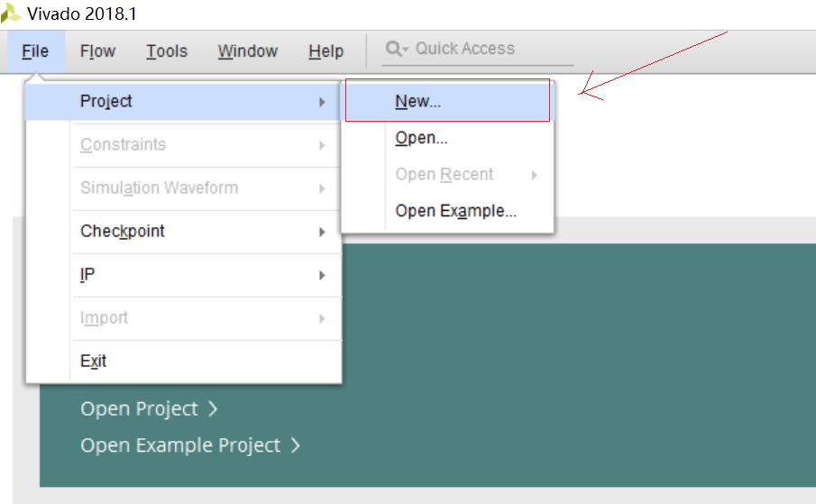
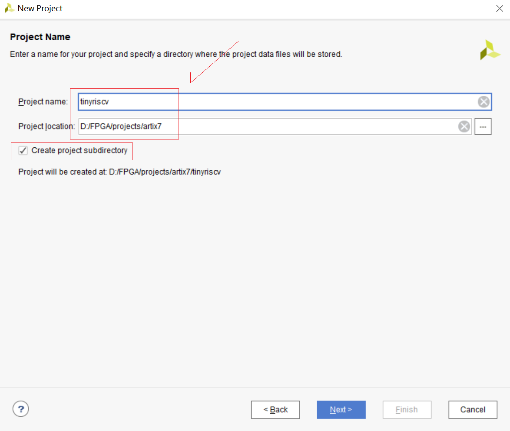
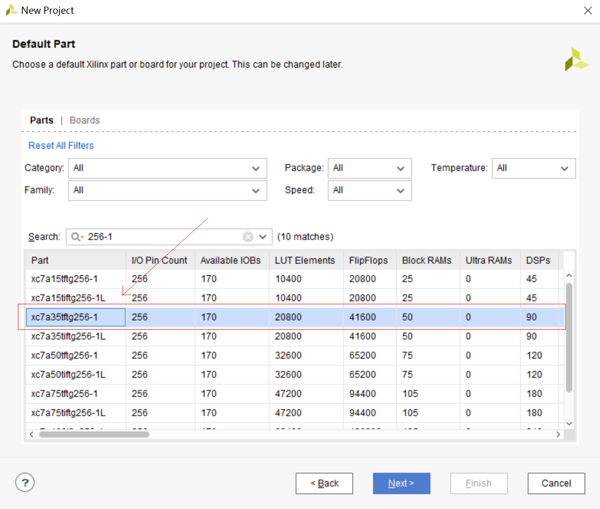
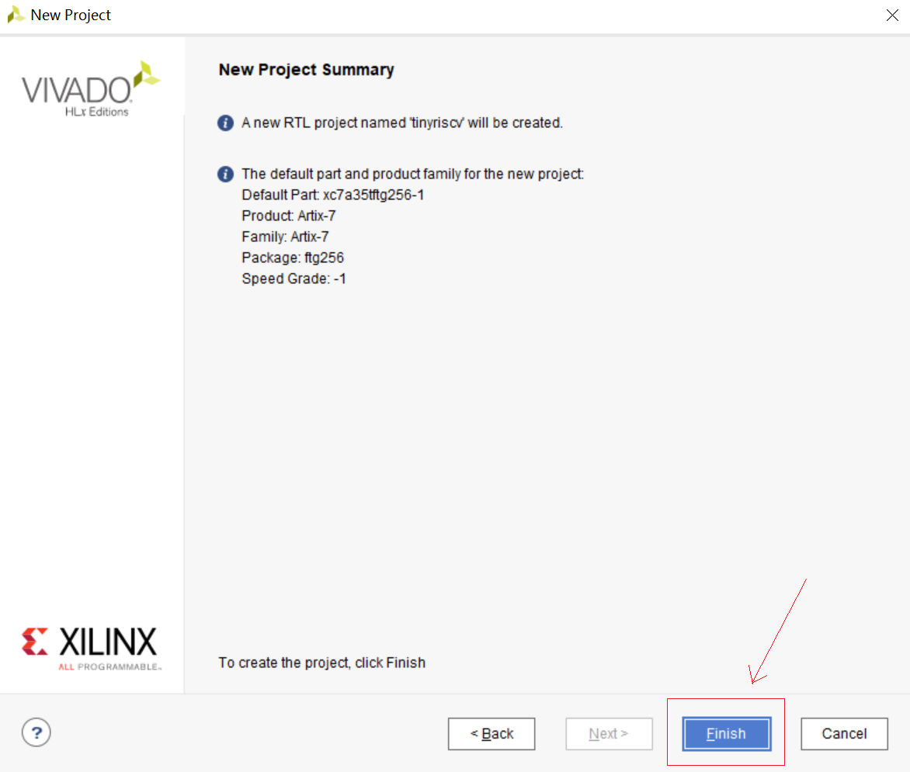
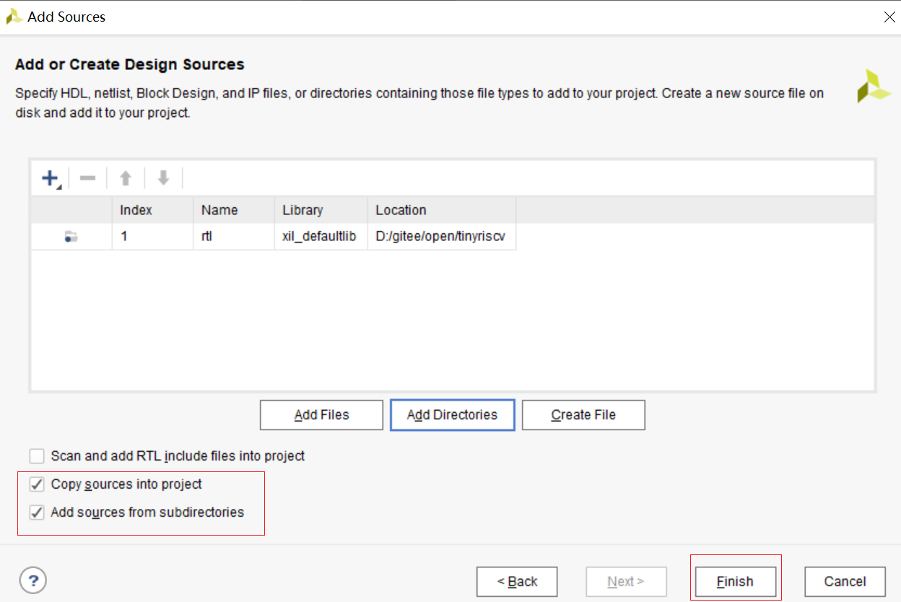
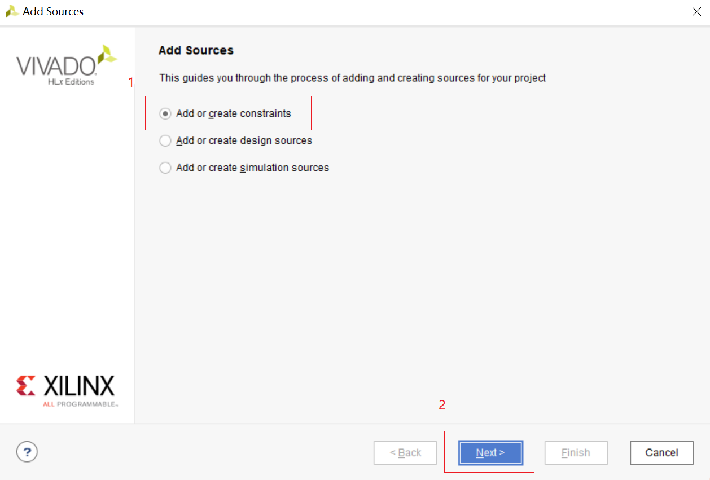
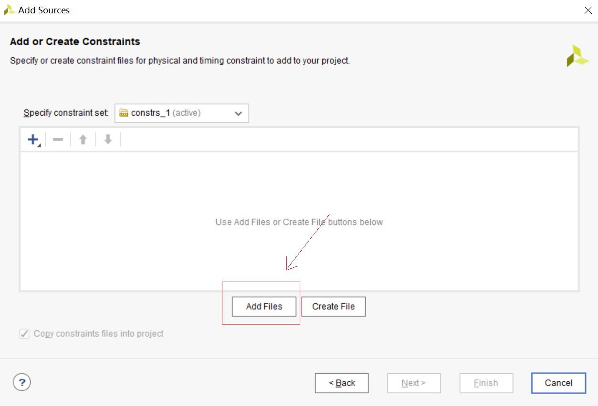
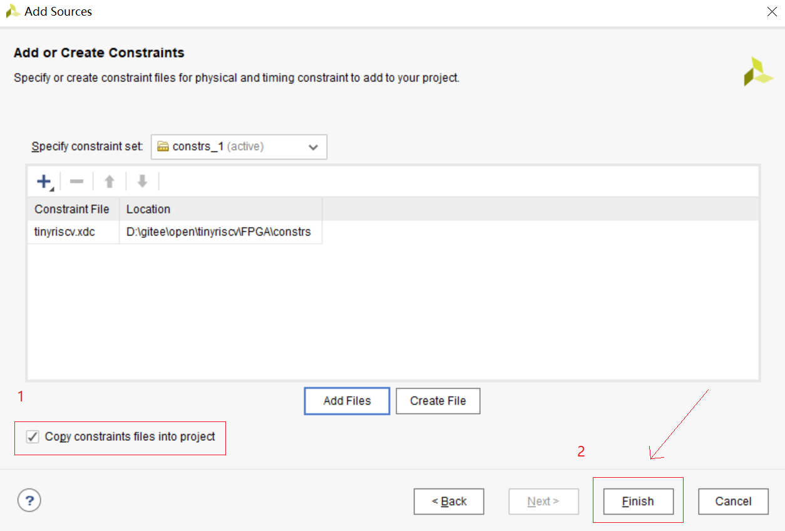
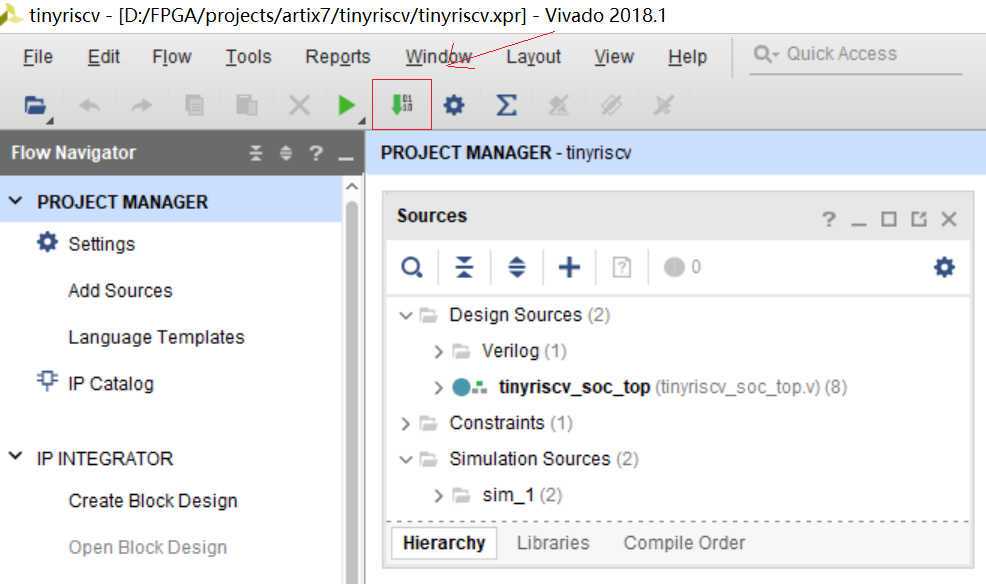
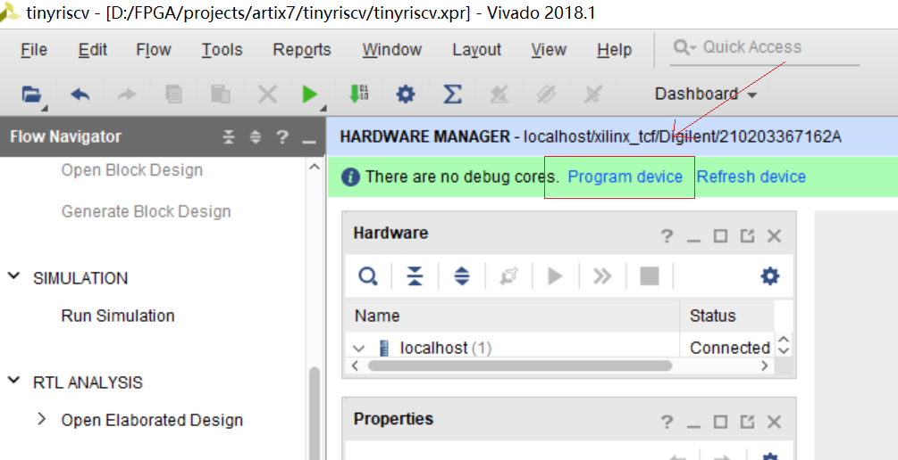

# 1.概述

介绍如何将tinyriscv移植到FPGA平台上。

1.软件：xilinx vivado(以2018.1版本为例)开发环境。

2.FPGA：xilinx Artix-7 35T。

# 2.步骤

## 2.1创建工程

首先打开vivado软件，新建工程，方法如下图所示：

或者通过File菜单新建工程，如下图所示：

然后进入下一步，如下图所示：

直接点击Next按钮，进入下一步，如下图所示：

输入工程名字和工程路径，勾选上Create project subdirectiry选项，然后点击Next按钮，如下图所示：

选择RTL Project，并勾选上Do not specify sources at this time，如下图所示：

在Search框里输入256-1，然后选中xc7a35tftg256-1这个型号，然后点击Next按钮，如下图所示：

直接点击Finish按钮。

至此，工程创建完成。

## 2.2添加RTL源文件

在工程主界面，点击左侧的Add Sources按钮，如下图所示：

进入到如下图的界面：

选中第二项Add or create design sources，然后点击Next按钮，如下图所示：

点击Add Directories按钮，选择tinyriscv项目里的整个rtl文件夹，如下图所示：

勾选上红色框里那两项，然后点击Finish按钮。

至此，RTL源文件添加完成。

## 2.3添加约束文件

在工程主界面，点击左侧的Add Sources按钮，如下图所示：

进入到如下图的界面：

选择第一项Add or create constraints，然后点击Next按钮，如下图所示：

点击Add Files按钮，选择tinyriscv项目里的FPGA/constrs/tinyriscv.xdc文件，如下图所示：

勾选上Copy constraints files into project，然后点击Finish按钮。

至此，约束文件添加完成。

## 2.4生成Bitstream文件

点击下图所示的Generate Bitstream按钮，即可开始生成Bitstream文件。

这包括综合、实现(布局布线)等过程，因此时间会比较长。

## 2.5下载Bitstream文件到FPGA

连接好下载器和FPGA开发板，将下载器插入PC，然后给板子上电，接着点击vivado主界面的左下角的Open Hardware Manager按钮，如下图所示：

接着，点击Open target按钮，然后选择Auto Connect，如下图所示：

连接成功后，点击Program device按钮，如下图所示：

弹出如下界面，然后直接点击Program按钮。

至此，Bitstream文件即可下载到FPGA。