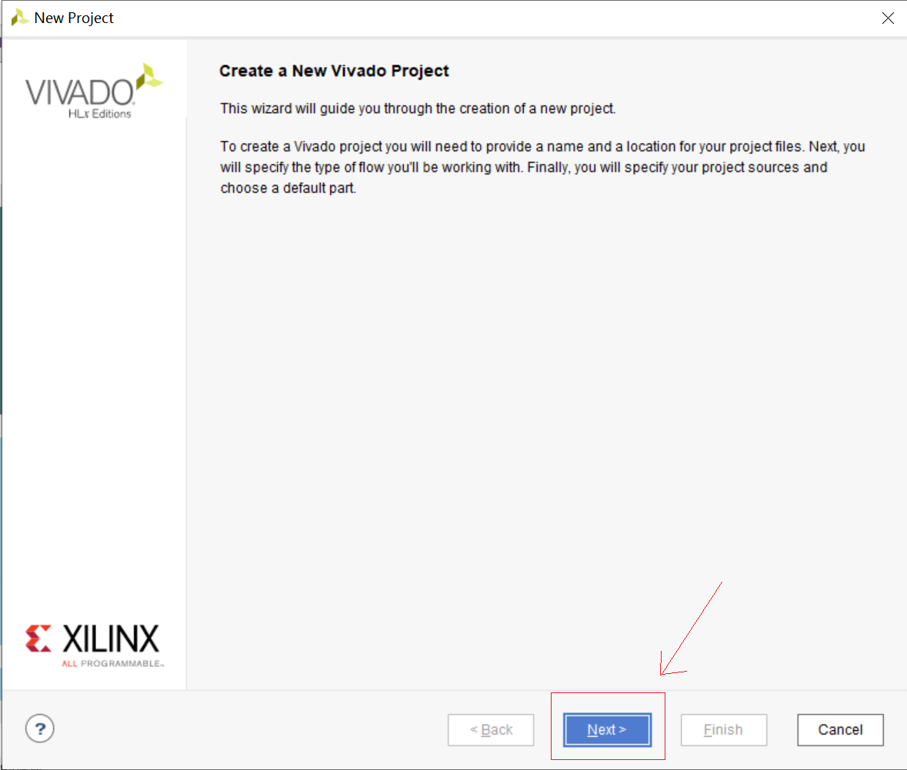
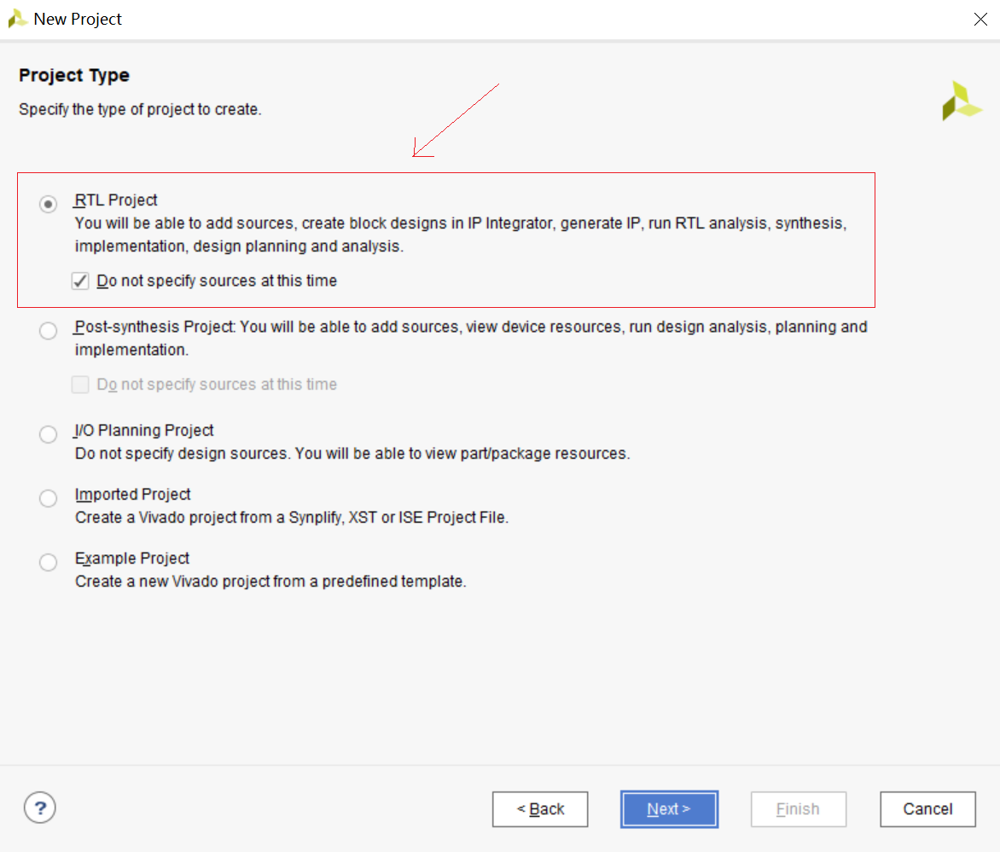
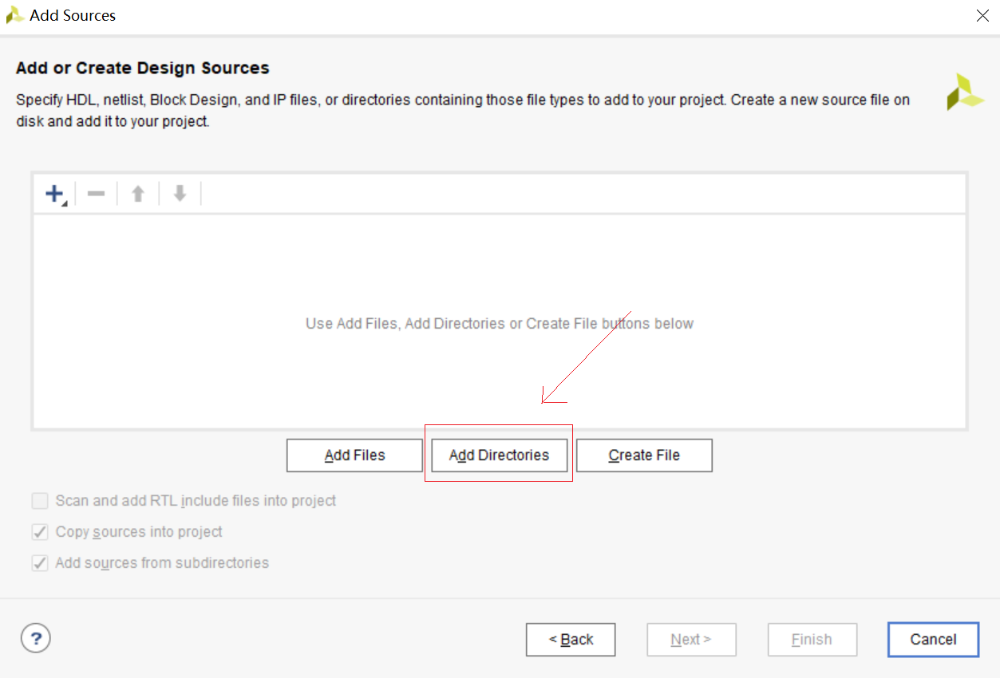
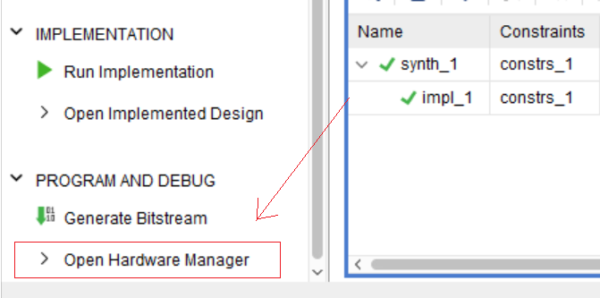
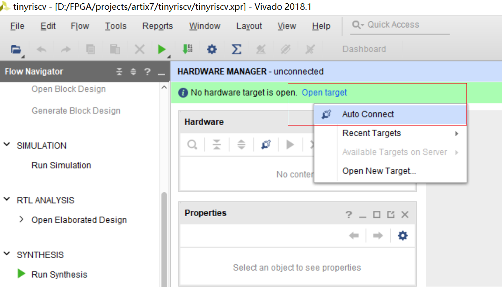
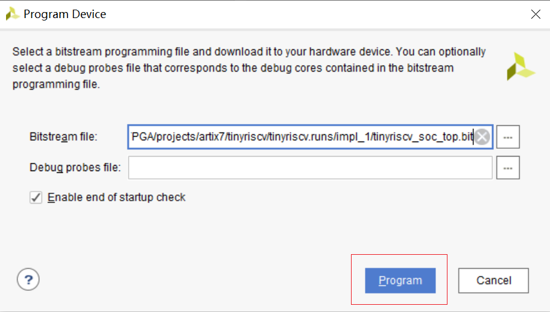
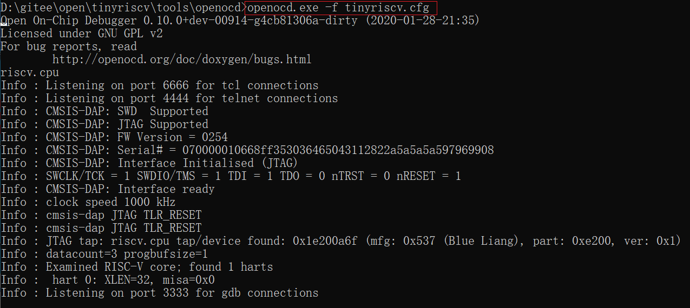
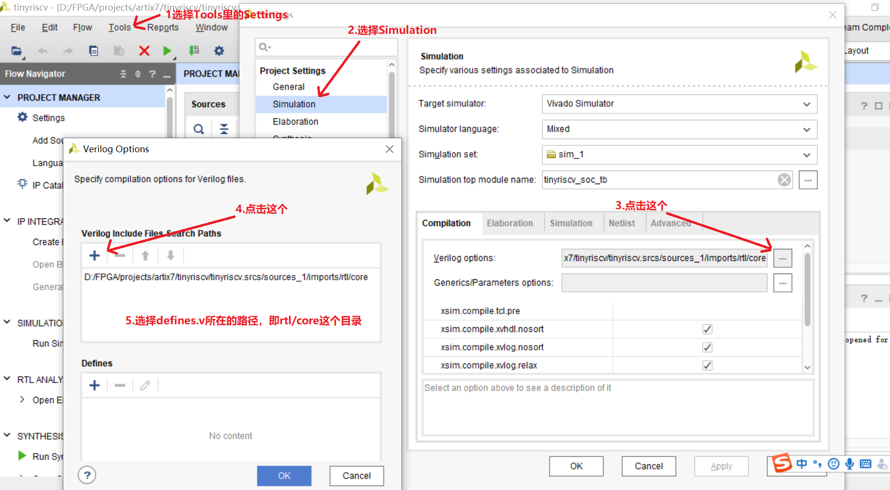

# 1.概述

介绍如何将tinyriscv移植到FPGA平台上和如何通过JTAG下载程序到FPGA。

1.软件：xilinx vivado(以2018.1版本为例)开发环境。

2.FPGA：xilinx Artix-7 35T。

3.调试器：CMSIS-DAP或者DAPLink。

# 2.FPGA移植步骤

## 2.1创建工程

首先打开vivado软件，新建工程，方法如下图所示：


或者通过File菜单新建工程，如下图所示：


然后进入下一步，如下图所示：



直接点击Next按钮，进入下一步，如下图所示：


输入工程名字和工程路径，勾选上Create project subdirectiry选项，然后点击Next按钮，如下图所示：



选择RTL Project，并勾选上Do not specify sources at this time，然后点击Next按钮，如下图所示：


在Search框里输入256-1，然后选中xc7a35tftg256-1这个型号，然后点击Next按钮，如下图所示：


直接点击Finish按钮。

至此，工程创建完成。

## 2.2添加RTL源文件

在工程主界面，点击左侧的Add Sources按钮，如下图所示：


进入到如下图的界面：


选中第二项Add or create design sources，然后点击Next按钮，如下图所示：



点击Add Directories按钮，选择tinyriscv项目里的整个rtl文件夹，如下图所示：


勾选上红色框里那两项，然后点击Finish按钮。

至此，RTL源文件添加完成。

## 2.3添加约束文件

在工程主界面，点击左侧的Add Sources按钮，如下图所示：


进入到如下图的界面：


选择第一项Add or create constraints，然后点击Next按钮，如下图所示：


点击Add Files按钮，选择tinyriscv项目里的FPGA/constrs/tinyriscv.xdc文件，如下图所示：


勾选上Copy constraints files into project，然后点击Finish按钮。**如果你的开发板和我的不一样，则需要将约束文件里的引脚配置改成你的开发板上对应的引脚**。

至此，约束文件添加完成。

## 2.4生成Bitstream文件

点击下图所示的Generate Bitstream按钮，即可开始生成Bitstream文件。

这包括综合、实现(布局布线)等过程，因此时间会比较长。


## 2.5下载Bitstream文件到FPGA

连接好下载器和FPGA开发板，将下载器插入PC，然后给板子上电，接着点击vivado主界面的左下角的Open Hardware Manager按钮，如下图所示：



接着，点击Open target按钮，然后选择Auto Connect，如下图所示：



连接成功后，点击Program device按钮，如下图所示：


弹出如下界面，然后直接点击Program按钮。



至此，即可将Bitstream文件下载到FPGA。

# 3.下载程序到FPGA

将CMSIS-DAP调试器连接好FPGA板子和PC电脑。

打开一个CMD窗口，然后cd进入到tinyriscv项目的tools/openocd目录，执行命令：

`openocd.exe -f tinyriscv.cfg`

如果执行成功的话则会如下图所示：



然后打开另一个CMD窗口，执行以下命令来连接openocd，注意电脑要启用telnet host服务。

`telnet localhost 4444`

接着执行以下命令来停住CPU：

`halt`

使用load_image命令将固件下载到FPGA，这里以freertos.bin文件为例，如下所示：

`load_image D:/gitee/open/tinyriscv/tests/example/FreeRTOS/Demo/tinyriscv_GCC/freertos.bin 0x0 bin 0x0 0x1000000`

使用verify_image命令来校验是否下载成功，如下所示：

`verify_image D:/gitee/open/tinyriscv/tests/example/FreeRTOS/Demo/tinyriscv_GCC/freertos.bin 0x0`

如果下载出错的话会有提示的，没有提示则说明下载成功。

最后断开与openocd的连接：

`exit`

整个下载过程如下图所示：


**注意：下载完成后需要退出openocd服务(ctrl+c)，然后按一下FPGA板子上的复位按键即可开始运行程序。**

不要通过reset或者resume命令来运行程序。

# 4.Vivado仿真设置

如果要在vivado里进行RTL仿真的话，还需要添加tb目录里的tinyriscv_soc_tb.v文件，具体方法和添加RTL源文件类似，只是在源文件类型里选择simulation sources，如下图所示：


最后设置一下define.v文件的路径，如下图所示：



最后，还要指定inst.data文件的路径，即修改tinyriscv_soc_tb.v文件里的下面这一行：

```
    // read mem data
    initial begin
        $readmemh ("F://yourpath/inst.data", tinyriscv_soc_top_0.u_rom._rom);
    end
```

设置完成后，即可进行RTL仿真。